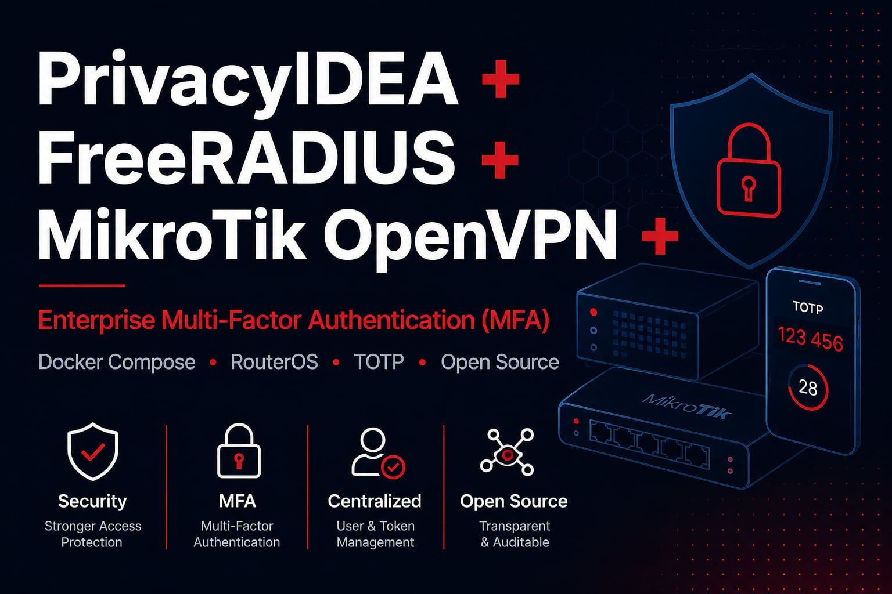

<p align="center">
  
</p>

# PrivacyIDEA + FreeRADIUS + MikroTik OpenVPN

> Enterprise Multi-Factor Authentication (MFA) for MikroTik OpenVPN using PrivacyIDEA, FreeRADIUS and Docker Compose.


---

# Project Overview

MikroTik RouterOS currently supports username/password authentication and certificates for OpenVPN but does **not** provide native support for Time-based One-Time Password (TOTP) authentication.

This project demonstrates how to build a complete enterprise-grade Multi-Factor Authentication (MFA) solution by combining:

- PrivacyIDEA
- FreeRADIUS
- Docker Compose
- MikroTik RouterOS
- OpenVPN

The result is a secure, scalable and production-ready authentication platform without requiring proprietary MFA appliances or commercial VPN solutions.

---

# Architecture

```
OpenVPN Client
        │
        ▼
MikroTik RouterOS
        │
     RADIUS
        │
        ▼
FreeRADIUS
        │
    Perl Module
        │
        ▼
PrivacyIDEA
        │
        ▼
MariaDB
```

---

# Features

- Enterprise Multi-Factor Authentication (MFA)
- Time-based One-Time Password (TOTP)
- Docker Compose deployment
- PrivacyIDEA authentication server
- FreeRADIUS integration
- MikroTik RouterOS integration
- OpenVPN support
- Centralized user management
- Secure RADIUS authentication
- Production-ready architecture
- Modular project structure
- Comprehensive documentation

---

# Repository Structure

```
.
├── docs/
│   ├── configuration.md
│   ├── faq.md
│   ├── installation.md
│   ├── security.md
│   ├── troubleshooting.md
│   └── freeradius-integration.md
│
├── freeradius/
│   ├── clients.conf
│   └── README.md
│
├── mikrotik/
│   ├── firewall.rsc
│   ├── openvpn-server.rsc
│   ├── ppp-profile.rsc
│   └── radius-client.rsc
│
├── images/
├── screenshots/
│
├── Dockerfile
├── docker-compose.yml
├── .env.example
├── .gitignore
├── ARCHITECTURE.md
├── CHANGELOG.md
├── LICENSE
└── README.md
```

---

# Requirements

- MikroTik RouterOS v7
- Docker Engine
- Docker Compose
- Linux Server
- Public DNS (recommended)
- OpenVPN Client

---

# Quick Start

```bash
git clone https://github.com/sarabelinformatika/privacyidea-freeradius-mikrotik-openvpn.git

cd privacyidea-freeradius-mikrotik-openvpn

cp .env.example .env

docker compose up -d
```

For a complete installation guide, see:

**docs/installation.md**

---

# Documentation

| Document | Description |
|-----------|-------------|
| installation.md | Complete installation guide |
| configuration.md | Configuration walkthrough |
| freeradius-integration.md | FreeRADIUS integration details |
| troubleshooting.md | Common issues and solutions |
| security.md | Security recommendations |
| faq.md | Frequently Asked Questions |

---

# Security

Before deploying into production:

- Generate new secret keys.
- Change all default credentials.
- Use strong RADIUS shared secrets.
- Restrict UDP ports 1812 and 1813.
- Enable HTTPS.
- Protect configuration backups.
- Keep Docker images up to date.
- Monitor authentication logs.
- Test disaster recovery procedures.

---

# Related Blog Article

This GitHub repository accompanies a detailed technical article published on the **SARABEL Informatika** website.

The article explains not only how the solution works, but also **why Multi-Factor Authentication (MFA) has become essential for securing MikroTik OpenVPN environments**.

## A jelszó önmagában már nem elég – így teheti biztonságossá MikroTik VPN kapcsolatát kétfaktoros hitelesítéssel (MFA)

The article covers:

- Why password-only VPN authentication is no longer sufficient
- Security risks of traditional VPN authentication
- How PrivacyIDEA integrates with MikroTik OpenVPN
- FreeRADIUS authentication workflow
- Docker Compose deployment
- Enterprise security considerations
- Practical implementation recommendations

Read the complete article:

**[https://sarabelinformatika.hu/blog/mikrotik-vpn-biztonsag-ketfaktoros-hitelesites-mfa](https://sarabelinformatika.hu/blog/a-jelszo-onmagaban-mar-nem-eleg-igy-teheti-biztonsagossa-mikrotik-vpn-kapcsolatat-ketfaktoros-hitelesitessel-mfa)**

---

# Technologies

- MikroTik RouterOS
- OpenVPN
- PrivacyIDEA
- FreeRADIUS
- Docker
- Docker Compose
- MariaDB
- Linux
- RADIUS
- TOTP
- Enterprise Authentication
- Multi-Factor Authentication (MFA)

---

# Related Resources

### Website

https://sarabelinformatika.hu

### LinkedIn

https://www.linkedin.com/company/sarabel-informatika-kft

### GitHub

https://github.com/sarabelinformatika

### Google Business Profile

https://share.google/WyzYNCwweENM06I3c

### MikroTik VPN Guide Repository

https://github.com/sarabelinformatika/mikrotik-vpn-guide

### SARABEL Infrastructure Repository

https://github.com/sarabelinformatika/sarabelinformatika

---

# License

This project is released under the MIT License.

---

# Author

**SARABEL Informatika Kft.**

Enterprise IT Infrastructure • Virtualization • Backup • Monitoring • Microsoft 365 • Linux

🌐 https://sarabelinformatika.hu
